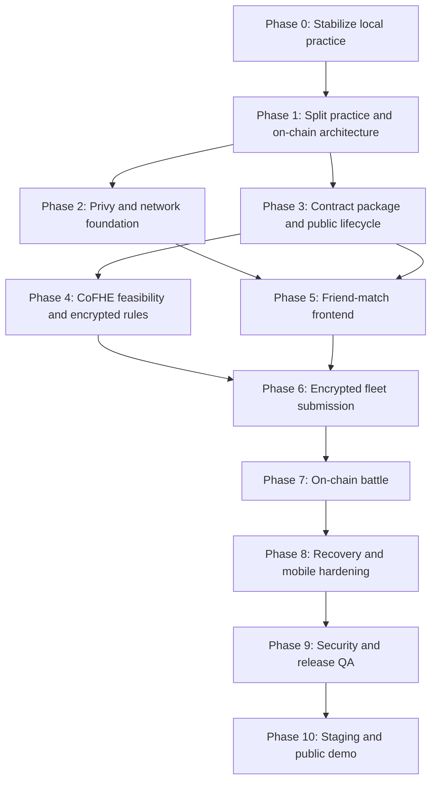

# Game Implementation Roadmap

## Purpose

This document is the active engineering roadmap for taking the repository from
the current local practice game to a public mobile-first on-chain friend-match
MVP on Arbitrum Sepolia.

It describes implementation work, dependencies, verification, and release exit
criteria. Product and architecture details remain in the linked specifications.

Roadmap date:

- June 10, 2026.

## Current Baseline

Implemented:

- playable local practice match against a bot;
- manual and automatic fleet placement;
- local Battleship rules and three bot difficulties;
- mobile-first React Three Fiber scene;
- attack, miss, hit, sunk, win, and forfeit presentation;
- runtime model, texture, VFX, and sound pipelines;
- deterministic unit, store, screen, and browser test suites;
- desktop and mobile Chromium practice-flow coverage;
- production Vite build.

Not implemented:

- explicit practice/on-chain application boundary;
- routing;
- Privy wallet connection;
- Arbitrum Sepolia guard;
- contract package;
- CoFHE client or encrypted contract logic;
- friend match creation and joining;
- contract-derived battle state;
- event recovery;
- staging or production deployment.

## MVP Outcome

The MVP is complete when two external-wallet players can:

1. Open the mobile web application.
2. Connect through Privy.
3. Switch to Arbitrum Sepolia if required.
4. Create or join a strict friend match.
5. Place and encrypt fleets without publishing plaintext.
6. Submit and validate fleets on-chain.
7. Alternate attacks through contract transactions.
8. Resolve public `Miss`, `Hit`, `Sunk`, and `Win` results through CoFHE.
9. Recover after refresh, mobile wallet handoff, account change, or interrupted
   finalization.
10. Finish by win, forfeit, cancellation, or supported timeout.

The local practice game must remain playable without a wallet.

## Delivery Principles

- Preserve practice mode while building on-chain mode beside it.
- Contract reads are authoritative for on-chain matches.
- Events trigger refetches; events are not the sole source of truth.
- Never add a temporary plaintext fleet contract.
- Clear plaintext placement after encrypted submission succeeds.
- Privy is the only wallet connection UI.
- Arbitrum Sepolia chain id `421614` is the only MVP chain.
- Keep every implementation slice releasable and tested.
- Update the owning design document in the same change as behavior.
- Do not begin post-MVP modes before the strict friend-match flow passes
  staging.

## Priority Legend

| Priority | Meaning |
| --- | --- |
| P0 | Required for the first honest on-chain MVP |
| P1 | Required for public release quality |
| P2 | Valuable after the MVP path is stable |

## Dependency Sequence



Phases 2 and 3 can run in parallel after Phase 1. Phase 5 may begin against
mocked typed contract clients while Phase 4 is being finalized, but no fleet or
attack API should be frozen before the CoFHE feasibility results exist.

## Phase 0: Stabilize Local Practice

Goal:

- protect the working game before introducing web3 complexity.

Progress:

- Phase 0 completed on June 10, 2026.
- `GAME-001` through `GAME-010` complete.

Tasks:

| ID | Priority | Status | Work |
| --- | --- | --- | --- |
| GAME-001 | P0 | Complete | Add Vitest, React Testing Library, jsdom, and Playwright |
| GAME-002 | P0 | Complete | Add deterministic RNG injection and shared seeded test utilities |
| GAME-003 | P0 | Complete | Test `board.ts`: bounds, overlap, no-touch rule, completion, auto placement |
| GAME-004 | P0 | Complete | Test `engine.ts`: miss, hit, sunk, win, turn passing, immutability |
| GAME-005 | P0 | Complete | Test bot difficulties and the public-information invariant |
| GAME-006 | P0 | Complete | Test Zustand orchestration, interrupted shots, forfeit, and rematch |
| GAME-007 | P0 | Complete | Add screen smoke tests with the 3D canvas mocked |
| GAME-008 | P1 | Complete | Add desktop and mobile Playwright practice-flow smoke tests |
| GAME-009 | P1 | Complete | Add a non-blank WebGL canvas check and loading failure test |
| GAME-010 | P1 | Complete | Add CI commands for build, unit, screen, and browser tests |

Required scripts:

```txt
npm test
npm run test:watch
npm run test:unit
npm run test:screen
npm run test:ci
npm run test:e2e
npm run test:e2e:install
```

Exit criteria:

- local game rules and bot behavior have deterministic tests;
- practice placement, attack, win, forfeit, rematch, and mute flows pass;
- `npm run build` and the automated test suite pass in a clean checkout;
- no behavior change is required to begin Phase 1.

Exit status:

- met on June 10, 2026.

Specification:

- `docs/local-prototype-test-plan.md`.

## Phase 1: Separate Practice and On-chain Modes

Goal:

- prevent the current local referee store from becoming mixed with contract
  state.

Tasks:

| ID | Priority | Status | Work |
| --- | --- | --- | --- |
| GAME-101 | P0 | Complete | Add a router and route-level application shell |
| GAME-102 | P0 | Complete | Keep local practice under an explicit practice route or mode boundary |
| GAME-103 | P0 | | Create an empty on-chain application shell and match route |
| GAME-104 | P0 | | Split practice orchestration from shared UI and scene state |
| GAME-105 | P0 | | Add a pure on-chain match phase resolver with tests |
| GAME-106 | P0 | | Introduce `PublicBattleRenderModel` and public board adapters |
| GAME-107 | P0 | | Refactor the 3D scene to consume mode-specific render data |
| GAME-108 | P1 | | Move shared English copy and error mappings into typed modules |
| GAME-109 | P1 | | Add a versioned deployment manifest reader |
| GAME-110 | P1 | | Support `/match/:deploymentId/:matchId` direct navigation and refresh |

Implementation rules:

- `src/game/engine.ts`, `src/game/bot.ts`, and the complete plaintext
  `MatchState` remain practice-only;
- shared code may include placement helpers, coordinates, models, effects,
  sound, and presentation components;
- the on-chain route must render from public contract-shaped data;
- route changes must not mutate contract state.

Exit criteria:

- practice mode behaves exactly as before;
- the app can render mocked on-chain match phases without importing the local
  attack engine;
- the router restores a versioned match route after refresh;
- phase resolver tests cover wallet, network, placement, battle, resolving,
  terminal, and unavailable states.

Specification:

- `docs/frontend-architecture.md`.

## Phase 2: Privy and Arbitrum Sepolia Foundation

Goal:

- establish wallet identity and a reliable write guard.

Tasks:

| ID | Priority | Work |
| --- | --- | --- |
| GAME-201 | P0 | Create Privy development and staging application configuration |
| GAME-202 | P0 | Install Privy React SDK and viem-compatible wallet integration |
| GAME-203 | P0 | Configure wallet-only login with external EVM wallets |
| GAME-204 | P0 | Implement active wallet, address, disconnect, and session UI |
| GAME-205 | P0 | Implement the Arbitrum Sepolia `421614` network guard |
| GAME-206 | P0 | Block every contract write when account, chain, or client readiness fails |
| GAME-207 | P0 | Implement wrong-network switch and rejection recovery |
| GAME-208 | P1 | Implement account-change and session-expiry cleanup |
| GAME-209 | P1 | Add Arbitrum Sepolia balance check and funding guidance |
| GAME-210 | P1 | Restore intended route after mobile wallet handoff |
| GAME-211 | P1 | Test MetaMask and Coinbase Wallet on desktop and mobile |

Exit criteria:

- local practice remains available while disconnected;
- an on-chain route can require an external wallet without creating an
  embedded wallet;
- writes cannot execute outside chain `421614`;
- connection, signature, and network-switch rejection are recoverable;
- account changes clear account-bound transient state;
- mobile return restores the intended match route.

Specification:

- `docs/network-and-wallet-requirements.md`.

## Phase 3: Contract Package and Public Match Lifecycle

Goal:

- create a tested contract foundation without introducing plaintext fleets.

Tasks:

| ID | Priority | Work |
| --- | --- | --- |
| GAME-301 | P0 | Create `contracts/` package with Hardhat and pinned Node/tool versions |
| GAME-302 | P0 | Install CoFHE Hardhat plugin, mock contracts, and Solidity dependencies |
| GAME-303 | P0 | Define enums, public views, errors, constants, and timeout configuration |
| GAME-304 | P0 | Implement strict `createMatch(invitedOpponent)` |
| GAME-305 | P0 | Implement invited-player `joinMatch(matchId)` |
| GAME-306 | P0 | Implement `cancelMatch`, `forfeit`, and timeout hooks |
| GAME-307 | P0 | Implement `getMatch`, `getPlayers`, and player match history reads |
| GAME-308 | P0 | Emit the specified lifecycle events |
| GAME-309 | P0 | Add access-control, invalid-status, deadline, and self-invite tests |
| GAME-310 | P1 | Add deterministic deployment and ABI/type generation scripts |
| GAME-311 | P1 | Add deployment record schema and bytecode/address validation |

Implementation rules:

- do not add plaintext fleet submission for convenience;
- use strict invited-wallet authorization for the MVP;
- keep open matches and bot matches disabled;
- keep contract state independent of any frontend or indexer.

Exit criteria:

- contract tests cover create, join, cancel, forfeit, and timeout transitions;
- generated ABI and frontend types come from the compiled artifact;
- deployment scripts can produce a local deployment record;
- no hidden fleet data exists in the public lifecycle implementation.

Specifications:

- `docs/contract-data-model.md`;
- `docs/contract-api.md`;
- `docs/smart-contract-design.md`.

## Phase 4: CoFHE Feasibility and Encrypted Rules

Goal:

- prove the encrypted data model before freezing the contract ABI.

Tasks:

| ID | Priority | Work |
| --- | --- | --- |
| GAME-401 | P0 | Pin a compatible CoFHE SDK, plugin, contracts, mocks, and compiler set |
| GAME-402 | P0 | Prototype 100 encrypted `uint8` cells with local CoFHE mocks |
| GAME-403 | P0 | Measure browser encryption time, calldata size, gas, and storage |
| GAME-404 | P0 | Compare cell array, batching, packed masks, and ship-list encodings |
| GAME-405 | P0 | Select and document the fleet encoding and submission transaction shape |
| GAME-406 | P0 | Implement encrypted placement validation and signed finalization |
| GAME-407 | P0 | Implement encrypted hit, sunk, remaining-health, and win computation |
| GAME-408 | P0 | Implement pending shot storage and signed result finalization |
| GAME-409 | P0 | Apply `FHE.allow*` permissions with least privilege |
| GAME-410 | P0 | Add replay, wrong hash, wrong signer, duplicate finalization, and stale request tests |
| GAME-411 | P1 | Benchmark full matches and establish a testnet gas budget |
| GAME-412 | P0 | Update API, data-model, and Fhenix docs against the implemented code |

Decision gate:

- if the baseline 100-cell model exceeds acceptable browser, calldata, gas, or
  storage budgets, change the encoding before frontend fleet integration;
- do not hide an impractical encoding behind batching without measuring the
  complete user flow.

Exit criteria:

- a mock-environment test submits and validates two encrypted fleets;
- a full attack can finalize `Miss`, `Hit`, `Sunk`, and `Win`;
- no client supplies the authoritative result;
- encrypted internals are not exposed through ordinary reads or events;
- the chosen ABI is generated and documented from real code.

Specification:

- `docs/fhenix-integration-plan.md`.

## Phase 5: Friend-match Frontend

Goal:

- make the public contract lifecycle usable before fleet encryption is wired
  into the UI.

Tasks:

| ID | Priority | Work |
| --- | --- | --- |
| GAME-501 | P0 | Load and validate the active versioned deployment record |
| GAME-502 | P0 | Create typed public and wallet clients |
| GAME-503 | P0 | Add typed contract reads, writes, error mapping, and receipt tracking |
| GAME-504 | P0 | Build wallet-aware onboarding and main menu |
| GAME-505 | P0 | Build `Play Against Friend` address input and validation |
| GAME-506 | P0 | Build create-match transaction flow and invite link |
| GAME-507 | P0 | Build join route, invited-wallet checks, and join transaction |
| GAME-508 | P0 | Build waiting, cancelled, expired, and unavailable match states |
| GAME-509 | P0 | Implement event-triggered targeted refetches |
| GAME-510 | P0 | Refetch on reconnect, focus, account change, and chain change |
| GAME-511 | P1 | Add transaction replacement, revert, drop, and retry handling |
| GAME-512 | P1 | Add explorer links and match identity display |

Exit criteria:

- two wallets can create and join a mock or local contract match from the UI;
- direct invite links resolve the correct deployment and match;
- duplicate transaction submission is prevented;
- events are deduplicated and followed by authoritative reads;
- refresh reconstructs the correct match phase.

Specifications:

- `docs/user-flows.md`;
- `docs/interface-and-buttons-guide.md`;
- `docs/copy-deck.md`.

## Phase 6: Encrypted Fleet Submission

Goal:

- connect the existing placement experience to encrypted contract state.

Tasks:

| ID | Priority | Work |
| --- | --- | --- |
| GAME-601 | P0 | Create a transient on-chain placement store separate from practice state |
| GAME-602 | P0 | Reuse local placement and no-touch validation for immediate UX |
| GAME-603 | P0 | Encode the completed fleet using the Phase 4 decision |
| GAME-604 | P0 | Initialize CoFHE client only after wallet and network readiness |
| GAME-605 | P0 | Run encryption/proof generation in workers when supported |
| GAME-606 | P0 | Submit encrypted fleet and track the receipt |
| GAME-607 | P0 | Clear plaintext cells, inputs, and account-bound encryption state after success |
| GAME-608 | P0 | Recover `ValidatingPlacement` after refresh or mobile handoff |
| GAME-609 | P0 | Display valid, invalid, waiting-for-opponent, and ready states |
| GAME-610 | P0 | Prevent cross-account or cross-chain encrypted input reuse |
| GAME-611 | P1 | Add encryption progress, retry, and actionable error states |
| GAME-612 | P1 | Verify no fleet data appears in storage, URLs, logs, analytics, or screenshots |

Owner fleet rule:

- the first on-chain slice should hide exact owner fleet geometry after
  submission;
- an owner-only `decryptForView` design is a separate post-MVP task unless it is
  explicitly reviewed and added before release.

Exit criteria:

- two wallets can submit valid encrypted fleets;
- invalid placement reaches a recoverable state;
- plaintext placement is absent after successful submission;
- refresh and mobile return recover from contract state;
- both valid fleets transition to match start.

## Phase 7: On-chain Battle and Terminal States

Goal:

- replace local battle authority with contract-derived attacks and results.

Tasks:

| ID | Priority | Work |
| --- | --- | --- |
| GAME-701 | P0 | Decode public board attacked, miss, hit, and sunk masks |
| GAME-702 | P0 | Feed contract-derived data into `PublicBattleRenderModel` |
| GAME-703 | P0 | Enable target selection only for the active wallet's valid turn |
| GAME-704 | P0 | Submit `attack(matchId, cellIndex)` and enter resolving state |
| GAME-705 | P0 | Read pending shot and run allowed `decryptForTx` finalization |
| GAME-706 | P0 | Process finalized moves idempotently by deployment and move id |
| GAME-707 | P0 | Play projectile and result effects only from finalized public outcomes |
| GAME-708 | P0 | Rebuild move history and boards after refresh |
| GAME-709 | P0 | Implement contract-derived victory and defeat summary |
| GAME-710 | P0 | Implement forfeit, cancellation, and timeout UI |
| GAME-711 | P0 | Make rematch create a new contract match |
| GAME-712 | P1 | Add permissionless pending-operation recovery UI |

Implementation rules:

- the frontend never calculates hit, sunk, winner, or turn changes;
- an attack receipt is not the final result;
- unresolved results must not trigger hit/miss effects;
- repeated events or refetches must not replay the same move indefinitely.

Exit criteria:

- two wallets can complete a full match through contract state;
- every shot produces one finalized public result and one visual sequence;
- refresh during `ResolvingShot` resumes safely;
- terminal state is reconstructed without local winner mutation.

## Phase 8: Mobile, Recovery, and UX Hardening

Goal:

- make the transaction-heavy game usable on real phones and unreliable
  connections.

Tasks:

| ID | Priority | Work |
| --- | --- | --- |
| GAME-801 | P0 | Test and fix mobile wallet handoff for every write path |
| GAME-802 | P0 | Recover pending receipts and contract phases after browser suspension |
| GAME-803 | P0 | Clear private state on account, chain, logout, and deployment changes |
| GAME-804 | P0 | Add low-balance, RPC failure, stale deployment, and unsupported wallet states |
| GAME-805 | P1 | Add required model-load retry and offline/network failure UI |
| GAME-806 | P1 | Meet 44x44 touch targets, safe-area, contrast, focus, and accessible-name requirements |
| GAME-807 | P1 | Add reduced motion and graphics quality controls |
| GAME-808 | P1 | Code-split wallet/on-chain routes and reduce the current large JS chunk |
| GAME-809 | P1 | Measure FPS, load, memory, battery, encryption time, and transaction latency |
| GAME-810 | P1 | Add English-only and raw-error exposure checks |

Exit criteria:

- iOS Safari and Android Chrome complete the friend-match flow;
- wallet rejection and network failure never strand the route;
- the application recovers after reload during every pending phase;
- mobile performance stays inside `docs/mobile-performance-budget.md`;
- accessibility blockers are resolved.

## Phase 9: Security and Release QA

Goal:

- prove the MVP is private, fair, recoverable, and releaseable.

Tasks:

| ID | Priority | Work |
| --- | --- | --- |
| GAME-901 | P0 | Add full contract unit and integration coverage |
| GAME-902 | P0 | Add fuzz/property tests for cells, masks, turns, and state transitions |
| GAME-903 | P0 | Test unauthorized joins, writes, finalization, replay, and timeout claims |
| GAME-904 | P0 | Test plaintext fleet leakage across browser and contract surfaces |
| GAME-905 | P0 | Add two-wallet frontend E2E against local mocks |
| GAME-906 | P0 | Add funded two-wallet Arbitrum Sepolia regression run |
| GAME-907 | P0 | Verify ABI, bytecode, deployment record, and frontend address agreement |
| GAME-908 | P1 | Review Privy origin, environment variable, logging, and analytics configuration |
| GAME-909 | P1 | Run dependency, Solidity static-analysis, and manual security review |
| GAME-910 | P1 | Update all architecture docs against actual packages, ABI, and behavior |

Release blockers:

- any plaintext fleet leak;
- ability to act for another wallet;
- ability to attack twice or attack outside the active turn;
- result supplied or overridden by the frontend;
- unresolved operation with no recovery or timeout path;
- deployment/ABI mismatch;
- reproducible mobile flow failure.

Exit criteria:

- security and test checklists pass;
- no P0 issue remains open;
- known P1 limitations are documented and accepted;
- the exact release candidate passes staging without local-only shortcuts.

## Phase 10: Staging and Public Testnet Demo

Goal:

- release an observable and reversible public testnet build.

Tasks:

| ID | Priority | Work |
| --- | --- | --- |
| GAME-1001 | P0 | Create stable staging Vercel project/domain and Privy origin |
| GAME-1002 | P0 | Deploy and record the staging Arbitrum Sepolia contract |
| GAME-1003 | P0 | Complete staging two-wallet and mobile acceptance tests |
| GAME-1004 | P0 | Create immutable production-demo deployment record |
| GAME-1005 | P0 | Deploy frontend with matching ABI, address, and deployment id |
| GAME-1006 | P0 | Verify direct invite links, assets, explorer links, and recovery |
| GAME-1007 | P1 | Add release notes, known limitations, and rollback ownership |
| GAME-1008 | P1 | Confirm Vercel rollback and contract redeploy procedures |
| GAME-1009 | P1 | Record performance, gas, transaction, and CoFHE finalization baselines |

Exit criteria:

- the production demo passes the complete friend-match flow;
- the deployment id, address, ABI hash, source commit, and explorer link are
  recorded;
- frontend rollback does not create contract ambiguity;
- old match links remain associated with their original deployment;
- practice mode still works without a wallet.

Specification:

- `docs/deployment-plan.md`.

## MVP Cut Line

Included in MVP:

- local practice mode;
- strict invited friend matches;
- Privy external wallet connection;
- Arbitrum Sepolia only;
- encrypted fleet placement;
- on-chain turn and result authority;
- public move history;
- win, cancel, forfeit, and required timeout recovery;
- mobile browser support;
- Vercel-hosted public testnet demo.

Explicitly deferred:

- open/public matchmaking;
- ranked mode;
- tournament mode;
- wagers;
- NFTs and marketplace;
- chat and social profiles;
- on-chain bot mode;
- embedded wallets and social login;
- sponsored gas or account abstraction;
- native mobile application;
- PWA/offline support;
- authoritative backend;
- generalized indexer;
- exact owner-fleet rendering after plaintext clearing;
- mainnet deployment.

## Definition of Done for Every Task

A roadmap task is complete only when:

- behavior is implemented, not only scaffolded;
- tests cover the new success and recovery paths;
- player-facing text is English;
- mobile layout and interaction are checked when UI changes;
- private data is not logged or persisted;
- `npm run build` passes;
- affected documentation is updated;
- no unrelated user work is reverted;
- the task is committed on its own branch and merged after verification.

## Status Tracking

Phase status:

| Phase | Status |
| --- | --- |
| 0. Stabilize local practice | Complete (June 10, 2026) |
| 1. Separate modes | In progress (GAME-101, GAME-102 complete) |
| 2. Privy and network | Not started |
| 3. Contract public lifecycle | Not started |
| 4. CoFHE encrypted rules | Not started |
| 5. Friend-match frontend | Not started |
| 6. Encrypted fleet UI | Not started |
| 7. On-chain battle | Not started |
| 8. Mobile and recovery | Not started |
| 9. Security and release QA | Not started |
| 10. Staging and public demo | Not started |

Update this table and the relevant task rows in the same merge that completes a
phase. Do not mark a phase complete based only on documentation or mocked UI.

## Related Documents

- `docs/current-playable-build.md`
- `docs/local-prototype-test-plan.md`
- `docs/frontend-architecture.md`
- `docs/network-and-wallet-requirements.md`
- `docs/contract-data-model.md`
- `docs/contract-api.md`
- `docs/fhenix-integration-plan.md`
- `docs/security-and-fair-play.md`
- `docs/testing-strategy.md`
- `docs/mobile-performance-budget.md`
- `docs/deployment-plan.md`
