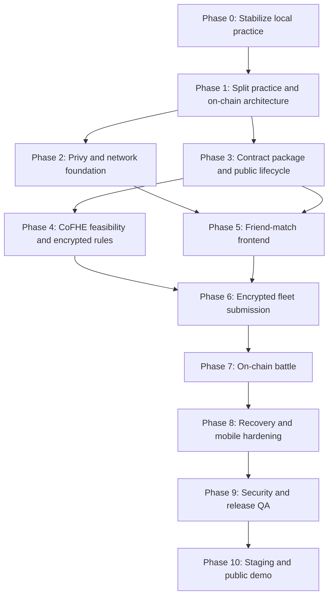

# Game Implementation Roadmap

## Purpose

This document is the active engineering roadmap for taking the repository from
the current local practice game to a public mobile-first on-chain friend-match
MVP on Arbitrum Sepolia.

It describes implementation work, dependencies, verification, and release exit
criteria. Product and architecture details remain in the linked specifications.

Roadmap date:

- June 10, 2026.

## Current Baseline

Implemented:

- playable local practice match against a bot;
- manual and automatic fleet placement;
- local Battleship rules and three bot difficulties;
- mobile-first React Three Fiber scene;
- attack, miss, hit, sunk, win, and forfeit presentation;
- runtime model, texture, VFX, and sound pipelines;
- deterministic unit, store, screen, and browser test suites;
- desktop and mobile Chromium practice-flow coverage;
- production Vite build.

Not implemented:

- explicit practice/on-chain application boundary;
- routing;
- Privy wallet connection;
- Arbitrum Sepolia guard;
- contract package;
- CoFHE client or encrypted contract logic;
- friend match creation and joining;
- contract-derived battle state;
- event recovery;
- staging or production deployment.

## MVP Outcome

The MVP is complete when two external-wallet players can:

1. Open the mobile web application.
2. Connect through Privy.
3. Switch to Arbitrum Sepolia if required.
4. Create or join a strict friend match.
5. Place and encrypt fleets without publishing plaintext.
6. Submit and validate fleets on-chain.
7. Alternate attacks through contract transactions.
8. Resolve public `Miss`, `Hit`, `Sunk`, and `Win` results through CoFHE.
9. Recover after refresh, mobile wallet handoff, account change, or interrupted
   finalization.
10. Finish by win, forfeit, cancellation, or supported timeout.

The local practice game must remain playable without a wallet.

## Delivery Principles

- Preserve practice mode while building on-chain mode beside it.
- Contract reads are authoritative for on-chain matches.
- Events trigger refetches; events are not the sole source of truth.
- Never add a temporary plaintext fleet contract.
- Clear plaintext placement after encrypted submission succeeds.
- Privy is the only wallet connection UI.
- Arbitrum Sepolia chain id `421614` is the only MVP chain.
- Keep every implementation slice releasable and tested.
- Update the owning design document in the same change as behavior.
- Do not begin post-MVP modes before the strict friend-match flow passes
  staging.

## Priority Legend

| Priority | Meaning |
| --- | --- |
| P0 | Required for the first honest on-chain MVP |
| P1 | Required for public release quality |
| P2 | Valuable after the MVP path is stable |

## Dependency Sequence



Phases 2 and 3 can run in parallel after Phase 1. Phase 5 may begin against
mocked typed contract clients while Phase 4 is being finalized, but no fleet or
attack API should be frozen before the CoFHE feasibility results exist.

## Phase 0: Stabilize Local Practice

Goal:

- protect the working game before introducing web3 complexity.

Progress:

- Phase 0 completed on June 10, 2026.
- `GAME-001` through `GAME-010` complete.

Tasks:

| ID | Priority | Status | Work |
| --- | --- | --- | --- |
| GAME-001 | P0 | Complete | Add Vitest, React Testing Library, jsdom, and Playwright |
| GAME-002 | P0 | Complete | Add deterministic RNG injection and shared seeded test utilities |
| GAME-003 | P0 | Complete | Test `board.ts`: bounds, overlap, no-touch rule, completion, auto placement |
| GAME-004 | P0 | Complete | Test `engine.ts`: miss, hit, sunk, win, turn passing, immutability |
| GAME-005 | P0 | Complete | Test bot difficulties and the public-information invariant |
| GAME-006 | P0 | Complete | Test Zustand orchestration, interrupted shots, forfeit, and rematch |
| GAME-007 | P0 | Complete | Add screen smoke tests with the 3D canvas mocked |
| GAME-008 | P1 | Complete | Add desktop and mobile Playwright practice-flow smoke tests |
| GAME-009 | P1 | Complete | Add a non-blank WebGL canvas check and loading failure test |
| GAME-010 | P1 | Complete | Add CI commands for build, unit, screen, and browser tests |

Required scripts:

```txt
npm test
npm run test:watch
npm run test:unit
npm run test:screen
npm run test:ci
npm run test:e2e
npm run test:e2e:install
```

Exit criteria:

- local game rules and bot behavior have deterministic tests;
- practice placement, attack, win, forfeit, rematch, and mute flows pass;
- `npm run build` and the automated test suite pass in a clean checkout;
- no behavior change is required to begin Phase 1.

Exit status:

- met on June 10, 2026.

Specification:

- `docs/local-prototype-test-plan.md`.

## Phase 1: Separate Practice and On-chain Modes

Goal:

- prevent the current local referee store from becoming mixed with contract
  state.

Progress:

- `GAME-101` through `GAME-110` complete.

Tasks:

| ID | Priority | Status | Work |
| --- | --- | --- | --- |
| GAME-101 | P0 | Complete | Add a router and route-level application shell |
| GAME-102 | P0 | Complete | Keep local practice under an explicit practice route or mode boundary |
| GAME-103 | P0 | Complete | Create an empty on-chain application shell and match route |
| GAME-104 | P0 | Complete | Split practice orchestration from shared UI and scene state |
| GAME-105 | P0 | Complete | Add a pure on-chain match phase resolver with tests |
| GAME-106 | P0 | Complete | Introduce `PublicBattleRenderModel` and public board adapters |
| GAME-107 | P0 | Complete | Refactor the 3D scene to consume mode-specific render data |
| GAME-108 | P1 | Complete | Move shared English copy and error mappings into typed modules |
| GAME-109 | P1 | Complete | Add a versioned deployment manifest reader |
| GAME-110 | P1 | Complete | Support `/match/:deploymentId/:matchId` direct navigation and refresh |

Implementation rules:

- `src/game/engine.ts`, `src/game/bot.ts`, and the complete plaintext
  `MatchState` remain practice-only;
- shared code may include placement helpers, coordinates, models, effects,
  sound, and presentation components;
- the on-chain route must render from public contract-shaped data;
- route changes must not mutate contract state.

Exit criteria:

- practice mode behaves exactly as before;
- the app can render mocked on-chain match phases without importing the local
  attack engine;
- the router restores a versioned match route after refresh;
- phase resolver tests cover wallet, network, placement, battle, resolving,
  terminal, and unavailable states.

Realized structure:

- practice orchestration lives in `src/practice/practiceStore.ts` behind the
  practice boundary; `src/game/engine.ts` and `src/game/bot.ts` stay
  practice-only;
- the 3D scene (`src/three/Scene.tsx`) renders battle boards from the shared,
  mode-neutral `BattleRenderModel` (`src/render/model.ts`), produced by the
  practice adapter (`src/practice/practiceRenderModel.ts`) and the public
  on-chain adapter (`src/onchain/renderModel.ts`, which never imports the attack
  engine);
- shared English copy and error mappings are typed modules under `src/copy/`;
- the versioned deployment manifest reader (`src/onchain/deployments.ts`)
  resolves `deploymentId`, rejecting unknown ids and any chain id other than
  `421614`;
- the `/match/:deploymentId/:matchId` route resolves its deployment on direct
  navigation and refresh, showing a recoverable unavailable state for unknown
  ids.

Specification:

- `docs/frontend-architecture.md`.

## Phase 2: Privy and Arbitrum Sepolia Foundation

Goal:

- establish wallet identity and a reliable write guard.

Progress:

- All P0 (`GAME-201`–`GAME-207`) and P1 (`GAME-208`–`GAME-211`) complete.
- Wallet session, network guard, write guard, account-epoch cleanup, balance/funding notice, and mobile handoff restore infrastructure landed and tested.

Tasks:

| ID | Priority | Status | Work |
| --- | --- | --- | --- |
| GAME-201 | P0 | Complete | Create Privy development and staging application configuration |
| GAME-202 | P0 | Complete | Install Privy React SDK and viem-compatible wallet integration |
| GAME-203 | P0 | Complete | Configure wallet-only login with external EVM wallets |
| GAME-204 | P0 | Complete | Implement active wallet, address, disconnect, and session UI |
| GAME-205 | P0 | Complete | Implement the Arbitrum Sepolia `421614` network guard |
| GAME-206 | P0 | Complete | Block every contract write when account, chain, or client readiness fails |
| GAME-207 | P0 | Complete | Implement wrong-network switch and rejection recovery |
| GAME-208 | P1 | Complete | Implement account-change and session-expiry cleanup |
| GAME-209 | P1 | Complete | Add Arbitrum Sepolia balance check and funding guidance |
| GAME-210 | P1 | Complete | Restore intended route after mobile wallet handoff |
| GAME-211 | P1 | Complete | Test MetaMask and Coinbase Wallet on desktop and mobile |

Realized structure:

- the single wallet/network layer lives under `src/onchain/wallet/`: pure,
  unit-tested core (`network.ts` Arbitrum Sepolia `421614` constant + guard,
  `session.ts` `deriveWalletSession`, `writeGuard.ts` `evaluateWriteReadiness`),
  a thin Privy + viem bridge (`privyConfig.ts`, `WalletProvider.tsx`,
  `WalletSessionContext.ts`), and prop-driven UI (`WalletSessionBar.tsx`,
  `WrongNetworkPanel.tsx`);
- Privy is the only connection UI (wallet-only login, embedded-wallet creation
  off, `supportedChains`/`defaultChain` = Arbitrum Sepolia); the build degrades
  to practice-only when `VITE_PRIVY_APP_ID` is unset;
- `evaluateWriteReadiness` is the central guard every future contract write must
  pass; Phase 2 has no contract calls yet, so it is built and tested but not yet
  gating a transaction;
- the `/match` route sources wallet/chain from the live session for real match
  ids; the `demo-*` URL harness stays self-contained until contract reads land.

Exit criteria:

- local practice remains available while disconnected;
- an on-chain route can require an external wallet without creating an
  embedded wallet;
- writes cannot execute outside chain `421614`;
- connection, signature, and network-switch rejection are recoverable;
- account changes clear account-bound transient state;
- mobile return restores the intended match route.

Specification:

- `docs/network-and-wallet-requirements.md`.

## Phase 3: Contract Package and Public Match Lifecycle

Goal:

- create a tested contract foundation without introducing plaintext fleets.

Progress:

- `GAME-301` through `GAME-311` complete (June 10, 2026).

Tasks:

| ID | Priority | Status | Work |
| --- | --- | --- | --- |
| GAME-301 | P0 | Complete | Create `contracts/` package with Hardhat and pinned Node/tool versions |
| GAME-302 | P0 | Complete | Install CoFHE Hardhat plugin, mock contracts, and Solidity dependencies |
| GAME-303 | P0 | Complete | Define enums, public views, errors, constants, and timeout configuration |
| GAME-304 | P0 | Complete | Implement strict `createMatch(invitedOpponent)` |
| GAME-305 | P0 | Complete | Implement invited-player `joinMatch(matchId)` |
| GAME-306 | P0 | Complete | Implement `cancelMatch`, `forfeit`, and timeout hooks |
| GAME-307 | P0 | Complete | Implement `getMatch`, `getPlayers`, and player match history reads |
| GAME-308 | P0 | Complete | Emit the specified lifecycle events |
| GAME-309 | P0 | Complete | Add access-control, invalid-status, deadline, and self-invite tests |
| GAME-310 | P1 | Complete | Add deterministic deployment and ABI/type generation scripts |
| GAME-311 | P1 | Complete | Add deployment record schema and bytecode/address validation |

Implementation rules:

- do not add plaintext fleet submission for convenience;
- use strict invited-wallet authorization for the MVP;
- keep open matches and bot matches disabled;
- keep contract state independent of any frontend or indexer.

Exit criteria:

- contract tests cover create, join, cancel, forfeit, and timeout transitions;
- generated ABI and frontend types come from the compiled artifact;
- deployment scripts can produce a local deployment record;
- no hidden fleet data exists in the public lifecycle implementation.

Exit status:

- met on June 10, 2026.

Realized structure:

- `contracts/` is a standalone Hardhat 2 package (Node `20.19.5` via `.nvmrc`,
  solc `0.8.25`, Cancun EVM target, exact-pinned dependencies) with the CoFHE
  set installed and pinned (`@fhenixprotocol/cofhe-contracts` 0.1.4, mock
  contracts and `cofhe-hardhat-plugin` 0.3.1, `cofhejs` 0.3.1); the plugin is
  loaded in Phase 4 because Phase 3 has no FHE operations, and
  `contracts/contracts/test/CofheCompileCheck.sol` proves the Solidity
  dependency compiles;
- `contracts/contracts/BattleshipGame.sol` implements the public lifecycle:
  strict `createMatch(invitedOpponent)` (zero-address and self-invite
  rejected), invited-only `joinMatch` with a 24-hour join deadline,
  creator-only `cancelMatch` before start (also the join-timeout recovery
  path), `forfeit` once an opponent exists, and `claimTimeoutWin` for
  placement and turn deadlines (fails closed until fleets and turns exist);
  fleet and attack APIs are deliberately absent until the Phase 4 decision
  gate, and timeouts are compiled-in constants so deployed bytecode stays
  byte-deterministic;
- reads are `getMatch`, `getPlayers`, `getPlayerMatches` (paginated, capped),
  and `getPlayerMatchCount`; lifecycle events are `MatchCreated`,
  `MatchJoined`, `MatchCancelled`, `MatchForfeited`, `TimeoutWinClaimed`;
- 47 Hardhat tests cover the transitions, access control, deadlines, and
  pagination; `contracts/contracts/test/BattleshipGameHarness.sol` (test-only,
  never deployed) forces Phase 4/7 states so timeout-win transitions are
  exercised today;
- `scripts/deploy.ts` writes immutable deployment records to
  `contracts/deployments/<chainId>/<deploymentId>.json` and verifies on-chain
  bytecode equals the artifact; `scripts/generate-abi.ts` emits
  `contracts/abi/BattleshipGame.json` and the viem `as const` module
  `src/onchain/abi/battleshipGame.ts`; `scripts/validate-deployment.ts` checks
  record schema, ABI hash, chain id, and bytecode hash against an RPC;
- CI runs the contracts package (`npm ci`, compile, test) as a separate job;
  `npm run test:contracts` delegates from the repository root.

Specifications:

- `docs/contract-data-model.md`;
- `docs/contract-api.md`;
- `docs/smart-contract-design.md`.

## Phase 4: CoFHE Feasibility and Encrypted Rules

Goal:

- prove the encrypted data model before freezing the contract ABI.

Progress:

- `GAME-401` through `GAME-412` complete (June 11, 2026).

Tasks:

| ID | Priority | Status | Work |
| --- | --- | --- | --- |
| GAME-401 | P0 | Complete | Pin a compatible CoFHE SDK, plugin, contracts, mocks, and compiler set |
| GAME-402 | P0 | Complete | Prototype 100 encrypted `uint8` cells with local CoFHE mocks |
| GAME-403 | P0 | Complete | Measure browser encryption time, calldata size, gas, and storage |
| GAME-404 | P0 | Complete | Compare cell array, batching, packed masks, and ship-list encodings |
| GAME-405 | P0 | Complete | Select and document the fleet encoding and submission transaction shape |
| GAME-406 | P0 | Complete | Implement encrypted placement validation and signed finalization |
| GAME-407 | P0 | Complete | Implement encrypted hit, sunk, remaining-health, and win computation |
| GAME-408 | P0 | Complete | Implement pending shot storage and signed result finalization |
| GAME-409 | P0 | Complete | Apply `FHE.allow*` permissions with least privilege |
| GAME-410 | P0 | Complete | Add replay, wrong hash, wrong signer, duplicate finalization, and stale request tests |
| GAME-411 | P1 | Complete | Benchmark full matches and establish a testnet gas budget |
| GAME-412 | P0 | Complete | Update API, data-model, and Fhenix docs against the implemented code |

Decision gate:

- if the baseline 100-cell model exceeds acceptable browser, calldata, gas, or
  storage budgets, change the encoding before frontend fleet integration;
- do not hide an impractical encoding behind batching without measuring the
  complete user flow.

Decision gate outcome:

- the gate triggered: the 100-cell baseline fails the validation budget
  (~1,000 FHE operations to prove per-ship cell counts), and 4 x 25 batching
  was measured to make encryption 3.8x slower while saving nothing. The
  encoding changed to the encrypted ship-segment list before any frontend
  fleet integration; measurements are in `docs/cofhe-feasibility-results.md`.

Exit criteria:

- a mock-environment test submits and validates two encrypted fleets;
- a full attack can finalize `Miss`, `Hit`, `Sunk`, and `Win`;
- no client supplies the authoritative result;
- encrypted internals are not exposed through ordinary reads or events;
- the chosen ABI is generated and documented from real code.

Exit status:

- met on June 11, 2026.

Realized structure:

- the compatible set (GAME-401) pins `@fhenixprotocol/cofhe-contracts`
  `0.0.13` (repinned from the mock-incompatible `0.1.4`), mock contracts and
  `cofhe-hardhat-plugin` `0.3.1`, `cofhejs` `0.3.1`, solc `0.8.25`; the
  hardhat network pins `hardfork: cancun` because the osaka EIP-7951
  precompile shadows the mock zk verifier address;
- encoding prototypes (`contracts/contracts/prototypes/`) and benchmark
  suites (`test/encodingBenchmarks.test.ts`, `test/fullMatchBenchmark.test.ts`)
  measured the four encodings and the full match
  (`docs/cofhe-feasibility-results.md`); the frozen encoding is
  `submitFleet(matchId, InEuint8[20])` ship segments with ship identity as
  public array position;
- `BattleshipGame.sol` implements encrypted placement validation (range,
  straightness, contiguity, row bounds, ~130 FHE ops), the encrypted shot
  pipeline (per-ship hit, health decrement, sunk, all-ships-dead win,
  ~110 FHE ops), pending shot/validation storage, and permissionless
  finalization plus retry functions; the pinned CoFHE line has no
  client-relayed decrypt results, so finalization reads the plaintext the
  network posts on-chain (`FHE.getDecryptResultSafe`) and no client ever
  supplies a result;
- least-privilege ACL: stored fleet handles get `FHE.allowThis` only; the
  only decrypted values are placement validity, the shot result enum, and
  the sunk ship id; encrypted state lives outside every read struct;
- 33 encrypted-rules tests cover validation verdicts, the full
  Miss/Hit/Sunk/Win match, replay, stale move ids, stale validity handles,
  forged-result rejection (aggregator-only channel), and not-ready
  finalization; input-to-sender binding is a zk-verifier guarantee that the
  mock disables, deferred to the GAME-906 testnet regression;
- the ResolvingShot recovery rule: stuck decryption is never a win;
  `retryShotResolution` / `retryFleetValidation` are permissionless and
  idempotent, and `forfeit` remains the exit.

Specifications:

- `docs/fhenix-integration-plan.md`;
- `docs/cofhe-feasibility-results.md`.

## Phase 5: Friend-match Frontend

Goal:

- make the public contract lifecycle usable before fleet encryption is wired
  into the UI.

Progress:

- `GAME-501` through `GAME-512` complete (June 11, 2026).

Tasks:

| ID | Priority | Status | Work |
| --- | --- | --- | --- |
| GAME-501 | P0 | Complete | Load and validate the active versioned deployment record |
| GAME-502 | P0 | Complete | Create typed public and wallet clients |
| GAME-503 | P0 | Complete | Add typed contract reads, writes, error mapping, and receipt tracking |
| GAME-504 | P0 | Complete | Build wallet-aware onboarding and main menu |
| GAME-505 | P0 | Complete | Build `Play Against Friend` address input and validation |
| GAME-506 | P0 | Complete | Build create-match transaction flow and invite link |
| GAME-507 | P0 | Complete | Build join route, invited-wallet checks, and join transaction |
| GAME-508 | P0 | Complete | Build waiting, cancelled, expired, and unavailable match states |
| GAME-509 | P0 | Complete | Implement event-triggered targeted refetches |
| GAME-510 | P0 | Complete | Refetch on reconnect, focus, account change, and chain change |
| GAME-511 | P1 | Complete | Add transaction replacement, revert, drop, and retry handling |
| GAME-512 | P1 | Complete | Add explorer links and match identity display |

Exit criteria:

- two wallets can create and join a mock or local contract match from the UI;
- direct invite links resolve the correct deployment and match;
- duplicate transaction submission is prevented;
- events are deduplicated and followed by authoritative reads;
- refresh reconstructs the correct match phase.

Exit status:

- met on June 11, 2026 (`src/onchain/friendMatchFlow.test.tsx` drives two
  wallets through create → invite link → join against a shared mock contract
  from the UI; the committed Arbitrum Sepolia deployment record stays
  `pending` until Phase 10 deploys a contract, so live-chain writes unlock
  with that record).

Realized structure:

- deployment resolution (GAME-501): `resolveDeployment` /
  `resolveActiveDeployment` in `src/onchain/deployments.ts` validate the
  versioned record behind every menu, create, and match route; unknown and
  invalid ids degrade to recoverable states;
- typed clients (GAME-502/503): `src/onchain/client/` wraps viem behind
  `BattleshipReadClient` / `BattleshipWriteClient` (`battleshipClient.ts`),
  maps the raw `getMatch` struct to the resolver's view (`mapping.ts`),
  decodes wallet/RPC/revert error chains to player copy (`decodeError.ts`,
  `src/copy/errors.ts`), and tracks every write through
  wallet → pending → confirmed/reverted/replaced/dropped (`txTracker.ts`,
  GAME-511) with simulation before the wallet prompt; the wallet provider
  exposes its viem clients through the session context;
- screens (GAME-504..506): `/` wallet-aware onboarding
  (`src/onchain/menu/EntryScreen.tsx`) routing a connected wallet to the
  practice hub, which doubles as the menu (`Play Against Friend` + the
  connected wallet bar with disconnect on `/practice`), and `/match/new`
  strict friend invite with address validation, clipboard paste,
  duplicate-submit guard, and post-receipt navigation to the versioned match
  route (`CreateFriendMatchScreen.tsx`); opponent selection and a separate
  menu route are folded into the practice hub while one on-chain mode exists;
- match route (GAME-507/508/512): `MatchRouteShell` loads authoritative state
  through `useMatchView`, renders join (deadline-aware), creator
  waiting/invite-link/cancel, expired, cancelled, forfeited, not-found, and
  retryable error states (`src/onchain/match/MatchLifecyclePanels.tsx`), plus
  match identity and Arbiscan links (`explorer.ts`); the `demo-*` URL harness
  remains for phase visualization only;
- refetch policy (GAME-509/510): `useMatchView` follows deduplicated contract
  events (block hash + log index) with `getMatch` reads and refetches on
  focus, visibility return, reconnect, account epoch, and chain changes;
- practice stays wallet-free: `/practice` unchanged, reachable from
  onboarding Skip, and its `Play Against Friend` button now routes to
  `/match/new`.

Specifications:

- `docs/user-flows.md`;
- `docs/interface-and-buttons-guide.md`;
- `docs/copy-deck.md`.

## Phase 6: Encrypted Fleet Submission

Goal:

- connect the existing placement experience to encrypted contract state.

Progress:

- `GAME-601` through `GAME-612` complete (June 11, 2026).
- The transient placement store, frozen 20-segment encoder, scoped CoFHE
  worker/client, typed fleet writes, public player-state reads, receipt-driven
  plaintext clearing, validation recovery, and privacy regression coverage
  are implemented and tested.

Tasks:

| ID | Priority | Status | Work |
| --- | --- | --- | --- |
| GAME-601 | P0 | Complete | Create a transient on-chain placement store separate from practice state |
| GAME-602 | P0 | Complete | Reuse local placement and no-touch validation for immediate UX |
| GAME-603 | P0 | Complete | Encode the completed fleet using the Phase 4 decision |
| GAME-604 | P0 | Complete | Initialize CoFHE client only after wallet and network readiness |
| GAME-605 | P0 | Complete | Run encryption/proof generation in workers when supported |
| GAME-606 | P0 | Complete | Submit encrypted fleet and track the receipt |
| GAME-607 | P0 | Complete | Clear plaintext cells, inputs, and account-bound encryption state after success |
| GAME-608 | P0 | Complete | Recover `ValidatingPlacement` after refresh or mobile handoff |
| GAME-609 | P0 | Complete | Display valid, invalid, waiting-for-opponent, and ready states |
| GAME-610 | P0 | Complete | Prevent cross-account or cross-chain encrypted input reuse |
| GAME-611 | P1 | Complete | Add encryption progress, retry, and actionable error states |
| GAME-612 | P1 | Complete | Verify no fleet data appears in storage, URLs, logs, analytics, or screenshots |

Owner fleet rule:

- the first on-chain slice should hide exact owner fleet geometry after
  submission;
- an owner-only `decryptForView` design is a separate post-MVP task unless it is
  explicitly reviewed and added before release.

Exit criteria:

- two wallets can submit valid encrypted fleets;
- invalid placement reaches a recoverable state;
- plaintext placement is absent after successful submission;
- refresh and mobile return recover from contract state;
- both valid fleets transition to match start.

Exit status:

- met on June 11, 2026. Contract tests already prove two encrypted fleets
  validate and auto-start; frontend tests cover the same submission and
  recovery boundaries with typed clients and a deterministic CoFHE fake.

Realized structure:

- `src/onchain/placement/fleetEncoding.ts` converts a locally complete,
  no-touch fleet to the frozen `InEuint8[20]` ship-segment order; plaintext
  remains only in `placementStore.ts`;
- `src/onchain/fhenix/` owns the account/chain/deployment/match-scoped CoFHE
  client. It initializes only behind the wallet write guard, runs inside a
  module worker when `Worker` is available, reports SDK proof stages, and
  terminates on scope changes or successful submission; unsupported browsers
  use the same scoped adapter on the main thread;
- the typed client reads `getPlayers` with `getMatch` and exposes
  `submitFleet`, `finalizeFleetValidation`, and `retryFleetValidation`.
  Contract reads remain authoritative after every event, focus return,
  reconnect, account change, and chain change;
- `EncryptedFleetPanel.tsx` provides manual/automatic placement, receipt
  tracking, immediate plaintext clearing, invalid-fleet resubmission,
  valid/waiting states, and refresh-safe validation finalization/retry;
- encrypted inputs are function-local, never reusable for retry, and never
  written to React state, storage, URLs, logs, analytics, browser globals, or
  screenshots. After submission, exact owner geometry is not rendered.

## Phase 7: On-chain Battle and Terminal States

Goal:

- replace local battle authority with contract-derived attacks and results.

Progress:

- `GAME-701` through `GAME-712` complete (June 11, 2026).

Tasks:

| ID | Priority | Status | Work |
| --- | --- | --- | --- |
| GAME-701 | P0 | Complete | Decode public board attacked, miss, hit, and sunk masks |
| GAME-702 | P0 | Complete | Feed contract-derived data into `PublicBattleRenderModel` |
| GAME-703 | P0 | Complete | Enable target selection only for the active wallet's valid turn |
| GAME-704 | P0 | Complete | Submit `attack(matchId, cellIndex)` and enter resolving state |
| GAME-705 | P0 | Complete | Read pending shot and run allowed `decryptForTx` finalization |
| GAME-706 | P0 | Complete | Process finalized moves idempotently by deployment and move id |
| GAME-707 | P0 | Complete | Play projectile and result effects only from finalized public outcomes |
| GAME-708 | P0 | Complete | Rebuild move history and boards after refresh |
| GAME-709 | P0 | Complete | Implement contract-derived victory and defeat summary |
| GAME-710 | P0 | Complete | Implement forfeit, cancellation, and timeout UI |
| GAME-711 | P0 | Complete | Make rematch create a new contract match |
| GAME-712 | P1 | Complete | Add permissionless pending-operation recovery UI |

Implementation rules:

- the frontend never calculates hit, sunk, winner, or turn changes;
- an attack receipt is not the final result;
- unresolved results must not trigger hit/miss effects;
- repeated events or refetches must not replay the same move indefinitely.

Exit criteria:

- two wallets can complete a full match through contract state;
- every shot produces one finalized public result and one visual sequence;
- refresh during `ResolvingShot` resumes safely;
- terminal state is reconstructed without local winner mutation.

Exit status:

- met on June 11, 2026 (`src/onchain/battle/onchainBattleFlow.test.tsx` drives
  two wallets through fire → resolve → finalize for Miss, Hit, and Win against
  the shared fake contract, plus refresh recovery, forfeit, timeout claim, and
  rematch).

Realized structure:

- `src/onchain/battle/publicBattleModel.ts` decodes the `uint128` public board
  masks and the finalized move history into `PublicBattleRenderModel`
  (GAME-701/702); remaining-ship counts derive from finalized `Sunk`/`Win`
  moves, never from placements, and spectators receive no battle model;
- the typed clients gained `getMoveHistory` (paginated past the contract's
  50-entry page cap) and `getPendingShot` reads plus `attack`,
  `finalizeAttack`, `retryShotResolution`, and `claimTimeoutWin` writes;
  `useMatchView` loads moves and the pending shot with the authoritative
  `getMatch`/`getPlayers` reads for battle and terminal statuses;
- `src/onchain/battle/OnchainBattlePanel.tsx` renders both public boards as
  tappable grids: target selection is enabled only on the viewer's valid turn
  with an untried cell (GAME-703), `attack` enters ResolvingShot off the
  receipt (GAME-704), and the resolving state offers the permissionless
  `finalizeAttack` and `retryShotResolution` recovery actions (GAME-705/712);
- shot effects fire exactly once per finalized public move: `moveFx.ts` keeps
  an in-memory cursor per deployment + match id (GAME-706), `useShotFx.ts`
  presents the newest finalized move (banner, cell flash, sfx, haptics) in
  both the battle panel and the terminal summary (GAME-707), and the first
  sighting of a match primes silently so refresh rebuilds boards and history
  without replaying effects (GAME-708);
- `src/onchain/battle/MatchSummaryPanel.tsx` renders victory/defeat/forfeit/
  timeout outcomes purely from contract state — winner, move count, final
  boards, history — and Rematch routes to `/match/new` with the old opponent
  prefilled, creating a brand-new contract match (GAME-709/710/711); the
  battle panel carries forfeit (confirmed) and the turn-deadline timeout claim
  (GAME-710);
- the pinned CoFHE line posts decrypt results on-chain, so "allowed
  `decryptForTx` finalization" (GAME-705) is realized as the permissionless
  `finalizeAttack(matchId, moveId)` reading `FHE.getDecryptResultSafe` —
  no client ever supplies a result.

## Phase 8: Mobile, Recovery, and UX Hardening

Goal:

- make the transaction-heavy game usable on real phones and unreliable
  connections.

Progress:

- `GAME-801` through `GAME-810` complete (June 11, 2026).

Tasks:

| ID | Priority | Status | Work |
| --- | --- | --- | --- |
| GAME-801 | P0 | Complete | Test and fix mobile wallet handoff for every write path |
| GAME-802 | P0 | Complete | Recover pending receipts and contract phases after browser suspension |
| GAME-803 | P0 | Complete | Clear private state on account, chain, logout, and deployment changes |
| GAME-804 | P0 | Complete | Add low-balance, RPC failure, stale deployment, and unsupported wallet states |
| GAME-805 | P1 | Complete | Add required model-load retry and offline/network failure UI |
| GAME-806 | P1 | Complete | Meet 44x44 touch targets, safe-area, contrast, focus, and accessible-name requirements |
| GAME-807 | P1 | Complete | Add reduced motion and graphics quality controls |
| GAME-808 | P1 | Complete | Code-split wallet/on-chain routes and reduce the current large JS chunk |
| GAME-809 | P1 | Complete | Measure FPS, load, memory, battery, encryption time, and transaction latency |
| GAME-810 | P1 | Complete | Add English-only and raw-error exposure checks |

Exit criteria:

- iOS Safari and Android Chrome complete the friend-match flow;
- wallet rejection and network failure never strand the route;
- the application recovers after reload during every pending phase;
- mobile performance stays inside `docs/mobile-performance-budget.md`;
- accessibility blockers are resolved.

Exit status:

- code-level criteria met on June 11, 2026 (`npm run build` + the unit/screen
  suites cover handoff ordering on every write, suspension recovery, private
  state clearing, degraded states, offline/asset-retry UI, stylesheet
  accessibility invariants, settings, perf aggregation, and copy checks);
- the on-device passes (iOS Safari / Android Chrome friend-match run and the
  performance measurements on a reference phone) follow the manual procedure
  in `docs/mobile-performance-budget.md` and remain part of Phase 9/10
  acceptance on real hardware.

Realized structure:

- `src/onchain/client/pendingTxStore.ts` persists each in-flight write's hash
  (sessionStorage; public identifiers only) keyed by
  deployment|match|address|kind; `useTrackedWrite(persistScope)` records the
  broadcast hash and clears it on any terminal state, and
  `src/onchain/client/usePendingTxRecovery.ts` re-attaches to stored hashes on
  mount and on visibility/focus return, then refetches the authoritative
  contract phase (GAME-802). All write panels pass scopes; handoff-intent
  ordering before every write is locked by
  `src/onchain/wallet/handoffWritePaths.test.tsx` (GAME-801);
- private placement state stays scope-bound: account, chain, logout,
  deployment, and unmount transitions wipe the plaintext fleet and dispose the
  scoped CoFHE client (`src/onchain/placement/privateStateClearing.test.tsx`);
  disconnect also clears handoff markers and pending-tx records (GAME-803);
- degraded states (GAME-804): `balanceStatus` gained 'low'
  (`LOW_BALANCE_THRESHOLD_WEI`, non-blocking `LowBalanceWarning`), RPC
  transport failures map to the `rpc-unreachable` copy on both read and write
  paths (`isRpcTransportError`), `src/onchain/useDeploymentHealth.ts` probes
  `getCode` to surface a stale-deployment state, and a failed EIP-1193
  provider resolution surfaces the unsupported-wallet message;
- `src/lib/online.ts` + the AppShell offline banner cover network loss, and
  the model-load overlay offers an explicit Retry action (GAME-805);
- accessibility (GAME-806): 44px minimum touch targets, a global
  `:focus-visible` outline, contrast lifts on footnote/status text, larger
  board grids (10x10 cells are the documented exception), and accessible-name
  coverage asserted by `src/test/accessibility.test.tsx`;
- `src/ui/settingsStore.ts` (GAME-807) persists motion + graphics-quality
  device preferences; quality drives Canvas dpr/antialias/shadows and the
  ocean shader per the budget table, reduced motion collapses CSS animation,
  camera damping, and VFX duration (system preference respected via
  `prefers-reduced-motion` and `[data-motion='reduced']`);
- code splitting (GAME-808): practice, create-match, and match routes are
  `lazy()` chunks, the Privy+viem bridge moved to the lazily loaded
  `src/onchain/wallet/PrivyWalletBridge.tsx`, and vendor chunks (three /
  viem / react) are split in `vite.config.ts`; the entry chunk dropped from
  ~2.5 MB to ~19 kB (7.5 kB gzip), and three.js (~839 kB) loads only with the
  practice scene;
- `src/lib/perf.ts` (GAME-809) records load time, fps (rAF sampler), JS heap,
  encryption duration, and wallet-to-terminal transaction latency, locally
  only, with a `?perf=1` overlay in the shell and `window.__PERF__` for
  manual runs (battery remains a manual procedure per the budget doc);
- `src/copy/copyQuality.test.ts` walks every exported copy string for
  English-only glyphs and developer-internal leakage, and
  `src/onchain/rawErrorExposure.test.tsx` drives raw revert/hex errors
  through the match route asserting only mapped copy renders (GAME-810).

## Phase 9: Security and Release QA

Goal:

- prove the MVP is private, fair, recoverable, and releaseable.

Progress:

- `GAME-901` through `GAME-910` complete (June 12, 2026).

Tasks:

| ID | Priority | Status | Work |
| --- | --- | --- | --- |
| GAME-901 | P0 | Complete | Add full contract unit and integration coverage |
| GAME-902 | P0 | Complete | Add fuzz/property tests for cells, masks, turns, and state transitions |
| GAME-903 | P0 | Complete | Test unauthorized joins, writes, finalization, replay, and timeout claims |
| GAME-904 | P0 | Complete | Test plaintext fleet leakage across browser and contract surfaces |
| GAME-905 | P0 | Complete | Add two-wallet frontend E2E against local mocks |
| GAME-906 | P0 | Complete | Add funded two-wallet Arbitrum Sepolia regression run |
| GAME-907 | P0 | Complete | Verify ABI, bytecode, deployment record, and frontend address agreement |
| GAME-908 | P1 | Complete | Review Privy origin, environment variable, logging, and analytics configuration |
| GAME-909 | P1 | Complete | Run dependency, Solidity static-analysis, and manual security review |
| GAME-910 | P1 | Complete | Update all architecture docs against actual packages, ABI, and behavior |

Release blockers:

- any plaintext fleet leak;
- ability to act for another wallet;
- ability to attack twice or attack outside the active turn;
- result supplied or overridden by the frontend;
- unresolved operation with no recovery or timeout path;
- deployment/ABI mismatch;
- reproducible mobile flow failure.

Exit criteria:

- security and test checklists pass;
- no P0 issue remains open;
- known P1 limitations are documented and accepted;
- the exact release candidate passes staging without local-only shortcuts.

Exit status:

- local security, privacy, property, browser E2E, dependency, Solidity lint,
  ABI, manifest, environment, logging, and documentation gates pass;
- the funded Arbitrum Sepolia regression command is implemented and requires
  two keys, balances, chain `421614`, matching runtime bytecode, and an active
  immutable deployment record before it sends transactions;
- the committed manifest remains `pending`, so the exact deployed-candidate
  execution, Privy HTTPS-origin confirmation, and physical iOS/Android pass are
  intentionally enforced as Phase 10 staging gates rather than simulated;
- full evidence and accepted P1 limitations are in
  `docs/phase-9-release-qa.md`.

## Phase 10: Staging and Public Testnet Demo

Goal:

- release an observable and reversible public testnet build.

Progress:

- repository-side release controls and stable Vercel staging/production
  origins implemented on June 12, 2026;
- the release-controls frontend is deployed to both stable origins with
  environment-specific pending deployment ids, and public desktop/mobile
  route, asset, metadata, and refresh checks pass;
- stable Vercel aliases are explicitly pinned with automatic custom-domain
  assignment disabled, keeping staging and production promotion independent;
- the immutable `arb-sepolia-staging-v1` contract is deployed and bytecode
  validated, and a funded two-wallet create/join/cancel lifecycle passes;
- Privy dashboard origin confirmation, the full encrypted match, physical
  mobile acceptance, and the separate production deployment remain open;
- June 12, 2026: the in-place Fhenix CoFHE testnet upgrade removed
  `createDecryptTask`, breaking `FHE.decrypt` for the deployed
  `cofhe-contracts` 0.0.13 staging contract and making the served FHE keys
  unparseable by the pinned `cofhejs` 0.3.1 (see `docs/phase-10-release.md`);
- June 12, 2026 (later): the contract, tooling, and test suite migrated to
  `cofhe-contracts` 0.1.4 / `@cofhe/hardhat-plugin` / `@cofhe/sdk` with
  permissionless proof-publishing finalizers (128 tests passing); the
  migrated contract is deployed as `arb-sepolia-staging-v2` and a funded
  two-wallet full encrypted match (fleets, validation, 22 shots, win)
  passed live with gas and CoFHE latency evidence; the frontend migration
  from `cofhejs` to `@cofhe/sdk/web` remains;
- operational details and exact remaining gates are recorded in
  `docs/phase-10-release.md`.

Tasks:

| ID | Priority | Status | Work |
| --- | --- | --- | --- |
| GAME-1001 | P0 | In progress | Stable staging/production Vercel project domains exist; exact Privy origins require dashboard confirmation |
| GAME-1002 | P0 | Complete | Deployed and validated immutable `arb-sepolia-staging-v2` record on the migrated CoFHE 0.1.x stack (v1 superseded by the upstream upgrade) |
| GAME-1003 | P0 | In progress | Funded full encrypted match (fleets, validation, 22 shots, win) passed live on staging-v2; frontend migration and physical mobile acceptance remain |
| GAME-1004 | P0 | Blocked | Create immutable production-demo deployment record after staging passes on the migrated CoFHE stack |
| GAME-1005 | P0 | In progress | Staging address/id and build gates implemented; production pairing awaits GAME-1004 |
| GAME-1006 | P0 | In progress | Public checks and live encrypted contract lifecycle pass; browser friend-match checks await the frontend @cofhe/sdk migration |
| GAME-1007 | P1 | Complete | Added release notes, known limitations, evidence requirements, and named rollback ownership |
| GAME-1008 | P1 | Complete | Added exact Vercel rollback and immutable contract redeploy procedures |
| GAME-1009 | P1 | Complete | Staging deployment, full-match gas, and live CoFHE encrypt/validation/shot latency baselines recorded in `phase-10-staging-full-match-evidence.json` |

Exit criteria:

- the production demo passes the complete friend-match flow;
- the deployment id, address, ABI hash, source commit, and explorer link are
  recorded;
- frontend rollback does not create contract ambiguity;
- old match links remain associated with their original deployment;
- practice mode still works without a wallet.

Specification:

- `docs/deployment-plan.md`.

## MVP Cut Line

Included in MVP:

- local practice mode;
- strict invited friend matches;
- Privy external wallet connection;
- Arbitrum Sepolia only;
- encrypted fleet placement;
- on-chain turn and result authority;
- public move history;
- win, cancel, forfeit, and required timeout recovery;
- mobile browser support;
- Vercel-hosted public testnet demo.

Explicitly deferred:

- open/public matchmaking;
- ranked mode;
- tournament mode;
- wagers;
- NFTs and marketplace;
- chat and social profiles;
- on-chain bot mode;
- smart wallets with a distinct account address (classic ERC-4337) — note:
  social login, embedded wallets, and EIP-7702 sponsored gas are now **shipped**
  (2026-06), and intentionally preserve the EOA address;
- native mobile application;
- PWA/offline support;
- authoritative backend;
- generalized indexer;
- exact owner-fleet rendering after plaintext clearing;
- mainnet deployment.

## Definition of Done for Every Task

A roadmap task is complete only when:

- behavior is implemented, not only scaffolded;
- tests cover the new success and recovery paths;
- player-facing text is English;
- mobile layout and interaction are checked when UI changes;
- private data is not logged or persisted;
- `npm run build` passes;
- affected documentation is updated;
- no unrelated user work is reverted;
- the task is committed on its own branch and merged after verification.

## Status Tracking

Phase status:

| Phase | Status |
| --- | --- |
| 0. Stabilize local practice | Complete (June 10, 2026) |
| 1. Separate modes | Complete (GAME-101 through GAME-110) |
| 2. Privy and network | Complete (GAME-201 through GAME-211) |
| 3. Contract public lifecycle | Complete (GAME-301 through GAME-311) |
| 4. CoFHE encrypted rules | Complete (GAME-401 through GAME-412) |
| 5. Friend-match frontend | Complete (GAME-501 through GAME-512) |
| 6. Encrypted fleet UI | Complete (GAME-601 through GAME-612) |
| 7. On-chain battle | Complete (GAME-701 through GAME-712) |
| 8. Mobile and recovery | Complete (GAME-801 through GAME-810) |
| 9. Security and release QA | Complete (GAME-901 through GAME-910) |
| 10. Staging and public demo | In progress (external release gates pending) |

Update this table and the relevant task rows in the same merge that completes a
phase. Do not mark a phase complete based only on documentation or mocked UI.

## Related Documents

- `docs/current-playable-build.md`
- `docs/local-prototype-test-plan.md`
- `docs/frontend-architecture.md`
- `docs/network-and-wallet-requirements.md`
- `docs/contract-data-model.md`
- `docs/contract-api.md`
- `docs/fhenix-integration-plan.md`
- `docs/cofhe-feasibility-results.md`
- `docs/security-and-fair-play.md`
- `docs/testing-strategy.md`
- `docs/mobile-performance-budget.md`
- `docs/deployment-plan.md`
