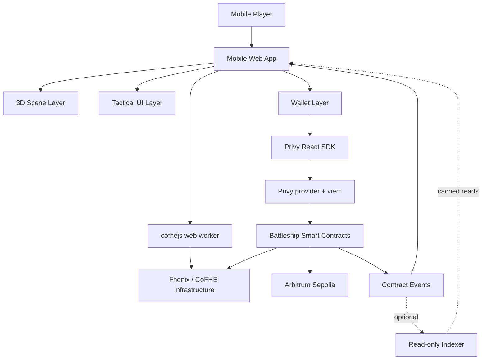
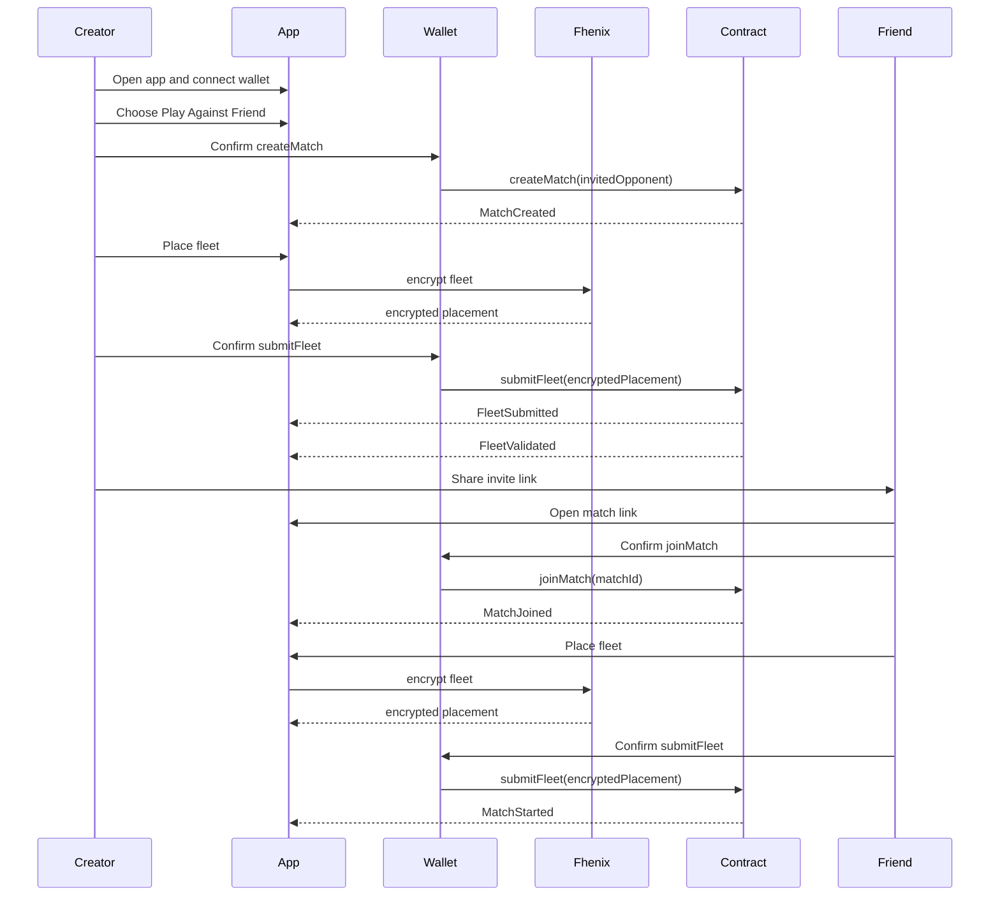
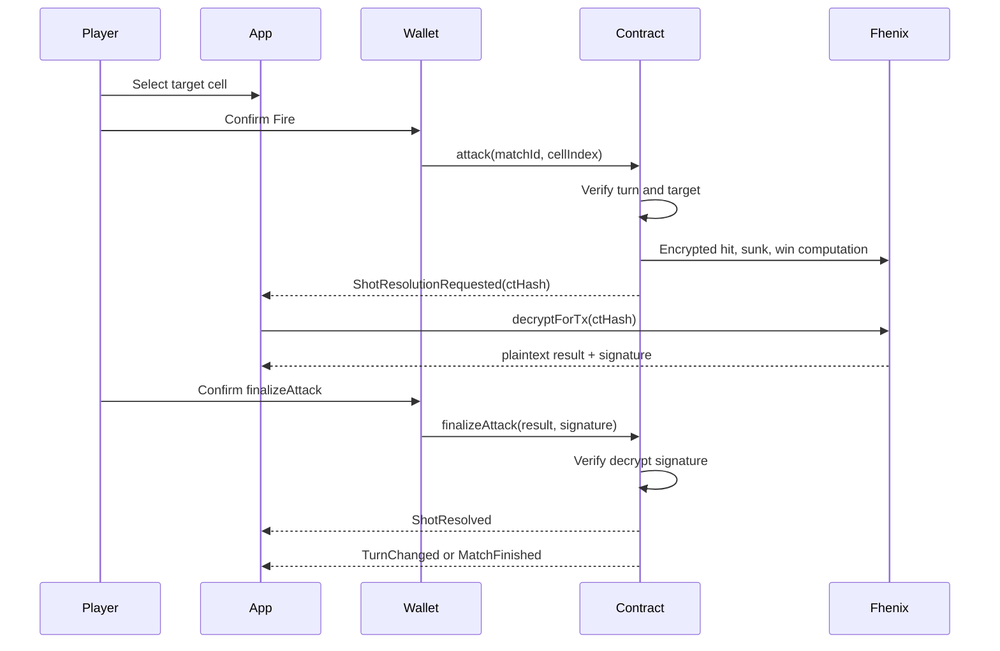

# Technical Architecture

## Purpose

This document defines the high-level technical architecture for the mobile-first 3D fully on-chain Battleship game.

It connects the product, smart contract, Fhenix, UI, 3D, and asset documents into one implementable system.

## Architecture Goals

The architecture must support:

- mobile browser first gameplay;
- 3D tactical board rendering;
- wallet connection;
- Arbitrum Sepolia as the MVP network;
- fully on-chain match state and rules;
- Fhenix/CoFHE for private encrypted gameplay state;
- friend invite PvP as the first flow;
- optional backendless bot mode later;
- no centralized authoritative game server;
- English-only UI and documentation.

## Non-goals

The MVP architecture should not include:

- native mobile app as the primary client;
- centralized gameplay backend;
- server-side hit detection;
- plaintext fleet storage;
- ranking service;
- marketplace;
- NFT ship ownership;
- chat;
- complex tournament infrastructure.

## Implemented MVP Stack

Frontend stack:

- React;
- Vite React for the first MVP implementation;
- React Three Fiber for 3D scene composition;
- Three.js under React Three Fiber;
- Privy React SDK for wallet login, external wallet connection, and session
  state;
- viem for contract reads and writes, assembled from Privy's wallet provider;
- `cofhejs 0.3.1` for Fhenix/CoFHE browser integration;
- Zustand for practice, placement, and device UI state.

Next.js can be considered later if the project needs broader website or content features.

Contract stack:

- Solidity;
- `@fhenixprotocol/cofhe-contracts`;
- `FHE.sol`;
- Hardhat `2.28.6`;
- `cofhe-hardhat-plugin 0.3.1`;
- CoFHE mock contracts for local testing.

Recommended network:

- Arbitrum Sepolia;
- chain id `421614`;
- Fhenix plugin name `arb-sepolia`.

Runtime asset formats:

- FBX for ship/board/prop models and GLB for VFX;
- compressed textures;
- mobile-friendly LODs where needed.

## System Overview

The game has five main layers:

1. Mobile web client.
2. 3D rendering layer.
3. Wallet and web3 layer.
4. Fhenix/CoFHE privacy layer.
5. Smart contracts on Arbitrum Sepolia.

Optional read-only layers:

- event indexer;
- analytics;
- static asset CDN.

These optional layers must never become authoritative for game rules.

## Source of Truth

The smart contract is the source of truth for:

- match creation;
- invited opponent;
- joined players;
- encrypted fleet submission status;
- fleet validation status;
- current turn;
- submitted attacks;
- resolved attack results;
- move history;
- timeout state;
- winner.

Fhenix/CoFHE is responsible for:

- encrypted input validation;
- encrypted state computation;
- threshold decryption flows;
- signed decrypt results for on-chain verification.

The frontend is responsible for:

- rendering;
- wallet interaction;
- local UX state;
- user input;
- encrypting player inputs through the SDK;
- submitting transactions;
- displaying contract-derived state.

The frontend must not decide:

- hit or miss;
- sunk or not sunk;
- win condition;
- valid final fleet state;
- whose turn it is.

## Frontend Application

The frontend is the only required user-facing client for the MVP.

Core responsibilities:

- mobile-first routing;
- onboarding;
- wallet connection;
- Arbitrum Sepolia network switching;
- friend match creation;
- invite link handling;
- fleet placement UI;
- Fhenix encryption progress;
- transaction confirmation states;
- 3D battle board;
- event-driven match updates;
- result and game over screens.

Recommended routes:

- `/` - first launch and onboarding;
- `/menu` - main menu;
- `/play` - opponent selection;
- `/match/new` - create friend match;
- `/match/{matchId}` - match lobby, join flow, placement, and battle;
- `/history` - match history;
- `/settings` - settings.

The exact route structure can change during implementation, but the match link must be stable enough to share with a friend.

## 3D Rendering Layer

The 3D layer renders:

- tactical ocean board;
- hidden enemy grid cells;
- player ships;
- selected cells;
- projectile animation;
- miss effect;
- hit effect;
- sunk marker;
- encrypted state props;
- turn token.

The 3D layer must be controlled by game state, not by contract logic directly.

Input responsibilities:

- raycast or tap target detection;
- cell hover or focus state;
- selected attack cell;
- ship drag, rotate, and placement if manual placement is enabled.

Output responsibilities:

- selected cell index;
- visual state transitions;
- animation completion signals for UI only.

The 3D layer must not:

- infer hidden enemy ships;
- calculate game results;
- unlock turns;
- mutate contract state without going through the transaction layer.

## Wallet and Web3 Layer

The wallet layer manages:

- connected account;
- network;
- wallet connection lifecycle;
- transaction submission;
- transaction receipt tracking;
- account or chain change events.

Recommended libraries:

- Privy React SDK for wallet-only authentication, connection UI, session, and
  active external wallet state;
- Privy's wagmi integration if wagmi hooks are used;
- viem for public and wallet clients;
- Privy's external-wallet connectors for injected and WalletConnect-compatible
  mobile wallets.

Privy is the only wallet connection surface. Do not add a second RainbowKit,
Web3Modal, or direct WalletConnect modal.

Required states:

- disconnected;
- connecting;
- connected wrong network;
- connected Arbitrum Sepolia;
- transaction pending;
- transaction confirmed;
- transaction failed.

The wallet layer should expose viem-shaped clients to the Fhenix SDK.

## Fhenix Client Layer

The Fhenix client layer wraps `cofhejs 0.3.1` behind
`src/onchain/fhenix/cofhe.worker.ts`.

Core responsibilities:

- create CoFHE config;
- create CoFHE client;
- connect client with viem public and wallet clients;
- encrypt fleet placement;
- manage permits;
- request `decryptForTx`;
- request `decryptForView` only for authorized view data;
- report progress and errors to the UI.

The Fhenix client should be initialized after:

- wallet is connected;
- chain is Arbitrum Sepolia;
- public client exists;
- wallet client exists.

Important UI states:

- `Fhenix Ready`;
- `Encrypting fleet`;
- `Preparing secure access`;
- `Resolving Shot`;
- `Publishing result`;
- `Fhenix request failed`.

## Smart Contract Layer

The MVP can start with one main contract:

- `BattleshipGame`

The contract handles:

- friend match creation;
- invited opponent restrictions;
- encrypted fleet submission;
- placement validation flow;
- match start;
- turn order;
- attack submission;
- encrypted hit detection;
- encrypted sunk and win checks;
- Fhenix decrypt result verification;
- public move history;
- game over;
- cancel and timeout hooks.

Optional later split:

- `BattleshipLobby`;
- `BattleshipGame`;
- `BattleshipVerifier`;
- `BattleshipBot`;
- `BattleshipEscrow`.

For the MVP, one contract is simpler, as long as the code is organized internally.

## Contract State Model Overview

The architecture expects the following state groups:

- match metadata;
- player state;
- encrypted fleet state;
- public attack bitsets;
- pending shot state;
- public move history;
- timeout state;
- optional bot state.

This document does not define exact structs. Exact storage belongs in:

- `docs/contract-data-model.md`

## Event-driven Synchronization

The frontend must update match state primarily from contract reads and events.

Core event categories:

- match lifecycle;
- fleet submission;
- fleet validation;
- match start;
- shot submitted;
- shot resolution requested;
- shot resolved;
- turn changed;
- match finished;
- match cancelled;
- timeout claimed.

The UI should never assume that a transaction receipt means the whole game state has advanced through Fhenix resolution. It should wait for the appropriate event or read the contract state again.

## Optional Read-only Indexer

An indexer can be used after the MVP core flow works.

Allowed responsibilities:

- cache public match list;
- cache public move history;
- speed up match history display;
- provide read-only projections for UI.

Forbidden responsibilities:

- choose match results;
- validate attacks;
- validate fleet placement;
- store plaintext fleet data;
- become required for core gameplay correctness.

If no indexer exists in MVP, the app can read directly from contracts and events.

## Friend Match Flow Architecture

## Attack Resolution Architecture

Important rule:

- the selected attack coordinate is public;
- the hidden defender board remains encrypted;
- only the final allowed result becomes public.

## Fhenix Result Finalization

Result finalization must be permissionless or at least not backend-dependent.

Possible finalizers:

- attacker;
- defender;
- any public caller;
- optional future keeper.

The finalizer submits:

- `ctHash`;
- plaintext result;
- Fhenix signature;
- match id;
- move id.

The contract verifies:

- match exists;
- move id is pending;
- `ctHash` matches the pending encrypted result;
- signature is valid;
- result is in allowed range;
- move has not already been finalized.

## Backendless Bot Architecture

Bot mode is optional and should not block the friend-match MVP.

If added, the backendless bot uses:

- `BotMatch` match type;
- contract-owned bot state;
- permissionless `executeBotMove(matchId)`;
- contract-selected target;
- Fhenix encrypted hit detection;
- same result finalization flow.

No project backend should choose the bot move.

## Data Privacy Boundaries

Plaintext fleet exists only:

- temporarily in the player's browser memory before encryption;
- never in contract storage;
- never in events;
- never in an indexer;
- never in logs.

Encrypted fleet exists:

- in smart contract storage;
- in Fhenix/CoFHE ciphertext handles;
- behind access control.

Public data includes:

- match id;
- player addresses;
- invited opponent address;
- match status;
- attack coordinates;
- resolved attack results;
- move history;
- winner.

## Mobile Performance Architecture

The mobile web app must remain responsive during:

- 3D rendering;
- wallet modals;
- Fhenix encryption;
- proof generation;
- transaction waiting;
- result resolution.

Guidelines:

- use Web Workers for Fhenix encryption when available;
- lazy-load heavy 3D assets;
- keep initial route lightweight;
- avoid blocking render while encrypting;
- use compressed `.glb` and textures;
- use instancing for repeated board cells;
- pause nonessential effects during wallet and Fhenix pending states;
- recover match state after page refresh through contract reads.

## Asset Loading Architecture

Asset groups:

- initial shell assets;
- menu background assets;
- board assets;
- ship assets;
- VFX assets;
- optional prop assets.

Loading priority:

1. App shell and onboarding.
2. Tactical board.
3. Fleet placement ships.
4. Battle VFX.
5. Optional decorative props.

Gameplay field loading rule:

- show functional shell UI before optional assets are loaded;
- do not show the gameplay field until required board, ship, and screen-specific effect models are loaded;
- use a dedicated loading screen for the gameplay field;
- optional decorative props can continue loading after the field appears;
- if required models fail, show a retry state instead of a partially rendered field.

## Deployment Architecture

MVP environments:

- local development;
- local Fhenix mock environment;
- Arbitrum Sepolia test deployment;
- public web preview deployment;
- production-like testnet deployment.

Deployment artifacts:

- frontend build;
- smart contract deployment addresses;
- ABI files;
- chain configuration;
- asset manifest;
- environment variables.

No private keys should be committed.

## Configuration

Required frontend config:

- Privy app id;
- Arbitrum Sepolia chain id;
- RPC URL;
- contract address;
- Fhenix supported chain setting;
- asset base URL;
- optional indexer URL.

Required contract config:

- CoFHE plugin/network config;
- deployment account;
- timeout constants;
- board size constants;
- fleet rules.

## Error Recovery Architecture

The app must recover from:

- wallet rejection;
- wrong network;
- page refresh during pending match;
- failed encryption;
- failed transaction;
- Fhenix decrypt request failure;
- stale `ctHash`;
- stale move id;
- duplicate finalization;
- opponent delay.

Recovery pattern:

1. Read match state from contract.
2. Determine current phase.
3. Rebuild local UI state.
4. Offer the valid next action.
5. Never guess hidden or unresolved data.

## Development Order

Recommended implementation order:

1. Static mobile UI shell.
2. Wallet connection and Arbitrum Sepolia switching.
3. Basic 3D board rendering.
4. Local contract mock for match lifecycle.
5. Fhenix SDK client setup.
6. Encrypted fleet submission prototype.
7. Friend match creation and invite link.
8. Fleet validation flow.
9. Attack transaction flow.
10. Fhenix result finalization.
11. Full friend-match end-to-end flow.
12. Polish, mobile performance, and testing.
13. Optional backendless bot mode.

## Key Implementation Risks

Highest risks:

- encrypted fleet encoding may be too expensive or too large;
- full placement validation may be too complex for MVP;
- Fhenix async resolution may require more pending states than expected;
- mobile wallets may interrupt or reload the page;
- 3D rendering and Fhenix proof generation may compete for mobile resources;
- event synchronization may be harder without an indexer;
- bot mode can distract from the friend PvP MVP.

Risk response:

- prototype Fhenix fleet encoding early;
- keep friend match as the first complete flow;
- use simple visual states before advanced animations;
- defer optional indexer until direct contract reads prove insufficient;
- defer bot mode until human attack resolution is stable.

## Open Decisions

The following decisions remain open:

- Hardhat or Foundry as the primary contract tool;
- exact encrypted fleet encoding;
- manual placement, auto placement, or both in MVP;
- full classic placement validation or simplified MVP validation;
- whether an indexer is included in MVP;
- whether PWA install support is included in MVP;
- exact mobile performance budgets;
- final asset compression pipeline.

Resolved frontend recommendation:

- use Vite React for the first MVP implementation;
- keep Next.js as a possible later option if the project needs broader website or content features.

## Next Documents

Implementation-level detail now lives in:

1. `docs/contract-data-model.md`
2. `docs/contract-api.md`
3. `docs/frontend-architecture.md`
4. `docs/security-and-fair-play.md`
5. `docs/testing-strategy.md`
6. `docs/copy-deck.md`

The remaining user-owned art workflow document is `docs/asset-production-pipeline.md`.
